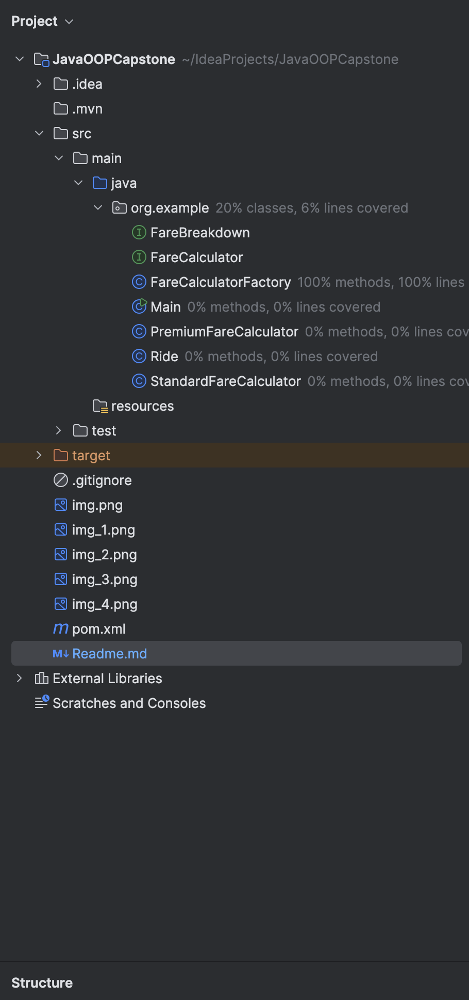
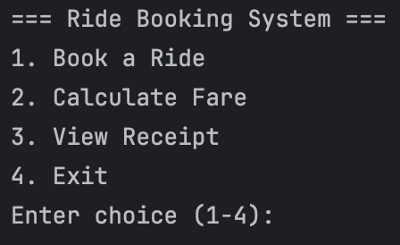
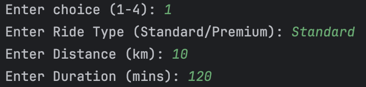
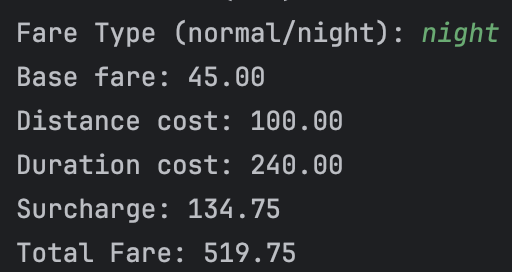
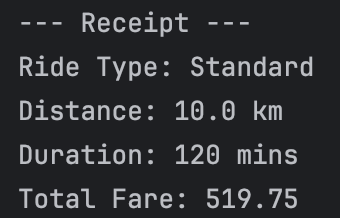
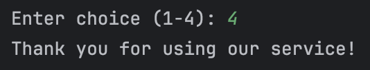

Group: Group 4

Group Members:
- Bombita, Virgil Ambrose
- Campos, Nicolas Scott
- Yang, Jerome

Project Title: Lab 3 - Java OOP Capstone Project

Brief Description:

- The Ride Fare Calculator application enables customers to easily book a ride and be able to calculate fares based on just the distance traveled and ride duration. It provides an accurate cost estimation and displays a detailed receipt for full transparency. The streamlined process ensures a hassle-free booking experience for its users.

Screenshots of Project Structure:

Screenshots of Output:

- Book a Ride

- Calculate Fare

- View Receipt

- Exit

